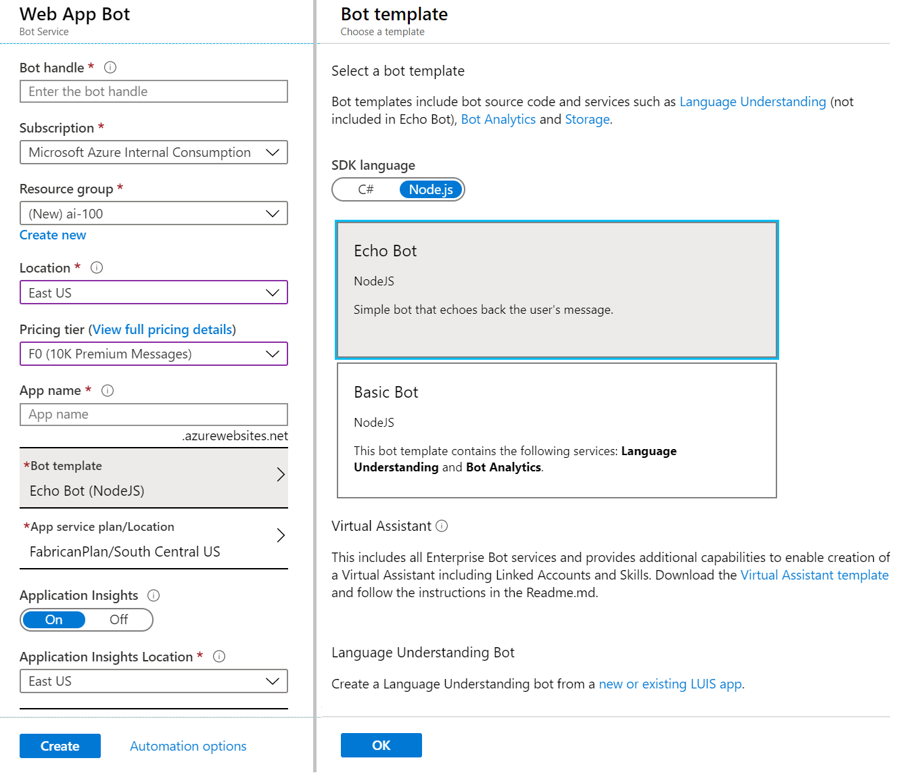
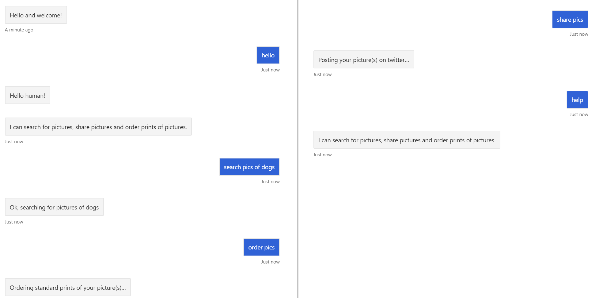

# Lab 3: Creating a Basic filtering bot

## Lab 3.0 A thought before starting

Every new technology brings with it as many opportunities as questions, and AI-powered technology has its own unique considerations.
Be mindful of the following AI Ethics principles when designing and implementing your AI tools:

1. *Fairness*: Maximize efficiencies without destroying dignity
1. *Accountability*: AI must be accountable for its algorithm
1. *Transparency*: Guard against bias and destruction of human dignity
1. *Ethical Application*: AI must assist humanity and be designed for intelligent privacy

We encourage you to [Read more](https://ai-ethics.azurewebsites.net/) about the Ethical considerations when building intelligent apps.

## Lab 3.1: Setting up for bot development

We will be developing a bot using the latest Node.js SDK. To get started, we'll need to download the Bot Framework Emulator, and we'll need to create a Web App Bot and get the source code.

Follow the directions for downloading the v4 SDK in the  [Lab1-Technical_Requirements](../Lab01/README.md).

#### Download the Bot Framework Emulator

Follow the directions provided in [Lab1-Technical_Requirements](../Lab01/README.md) to download the v4 Preview Bot Framework Emulator to enable you to test your bot locally.

## Create an Azure Web App Bot

A bot created using the Microsoft Bot Framework can be hosted at any publicly-accessible URL.  For the purposes of this lab, we will register our bot using [Azure Bot Service](https://docs.microsoft.com/en-us/bot-framework/bot-service-overview-introduction).

1. Navigate to the portal. In the portal, click **+ Create a resource** and search for "bot". Select **Web App Bot**, and click **Create**.
2. For the name, you'll have to create a unique identifier. We recommend using something along the lines of **PictureBotxxN** where `xx` is your initials and `N` is a number (e.g. mine would be PictureBotamt6).
3. Select in the region: *East US*.
4. For pricing tier, select **F0**, as that is all we will need for this lab.
5. Select a Bot template of **Echo Bot** in **Node.js**, we will update this code to be our PictureBot.
6. Configure a new *App service plan* (put it in the same location as your bot).
7. You can choose to turn *Application Insights* on or off.
8. **Do not** change or click on "Auto create App ID and password", we will get to that later. Click create.



When it's deployed, go to the Web App Resource. You have just deployed a very simple EchoBot with the Echo Bot template. If you wish, you can select the "Test in WebChat" tab once it's deployed, and see what it is capable of doing.

Since this isn't the entirety of the bot we set out to build, the next thing you need to do is download the source code. We'll edit this throughout the next few labs, and then we'll publish it back to this service.

Navigate to the **Build** tab within the portal, and select **Download Bot source code**. Save it somewhere convenient and extract all the files from the zip file.

While you've got the Azure portal open, now is also a good time to find and save the `MicrosoftAppId` and `MicrosoftAppPassword` located in **Configuration > Application Settings** section of your Web App Bot service.

> For future bot-building ventures, you can either start by creating a bot in the portal and downloading the source code (which is what we're doing here), or you can use the Bot Builder template, and we've provided instructions on how to do that: [Lab1-Technical_Requirements](../Lab01/README.md).

## Lab 3.2: Creating a simple bot and running it

>Note: In this lab, we will setup code and logic for our bot. You may see some topics in the code (e.g. LUIS) that apply to lessons not yet covered: we will address this functionality in subsequent lessons.

Navigate to the solution file for the Web App Bot you just created, and open it in VS Code. Spend some time looking at all of the different things you get built in from the Echo Bot template. We won't spend time explaining every single file, but we **highly recommend** spending some time **later** working through and reviewing this sample (and the other Web App Bot sample - Basic Bot), if you have not already. It contains important and useful shells needed for bot development. You can find it and other useful shells and samples [here](https://github.com/Microsoft/BotBuilder-Samples).

For the purposes of this lab, we will modify aspects of the template to fit our needs, which is what you would likely do in the real world as well.

Next, in the `.env` file, check if it to include the following, from your bot service information as well:

```ini
MicrosoftAppId=12345
MicrosoftAppPassword=ABC12345
ScmType=None
```

>Important: you will need to update this information if switching to a different Bot Service

Next, we'll focus on the npm packages we need. Open file `package.json`.

We need following packages be installed 

```json
    "dependencies": {
        "botbuilder": "~4.6.1",
        "botbuilder-dialogs": "^4.8.0",
        "dotenv": "^8.2.0",
        "restify": "~8.4.0"
    },
```

>NOTE: This lab has not been tested with newer versions then mentioned above.

Next, open a new terminal and make sure you are in the project folder. Then run following command to install packages. 

```cmd
npm install
```

Now start your bot (with or without debugging) by pressing the button that looks like a play button (or by hitting F5 on your keyboard).

#### Using the Bot Framework Emulator

To interact with your bot:

* Launch the Bot Framework Emulator (note we are using the v4 Emulator).  Click **Start**, then search for **Bot Emulator**.

* On the welcome page, click **Create a new bot configuration**

*  For the name, type **PictureBot**

*  Enter the url that is displayed on your bot web page and add `/api/messages` to the end of url

*  Enter the AppId and the App Secret your entered into the `.env`

>**Note** If you do not enter id and secret values into the bot settings you would also not need to enter the values in the bot emulator

*  Click **Save and connect**, then save your .bot file locally

* You should now be able to converse with the bot.

* Type **hello**. The bot will respond with echoing your message.

> **Note** You can select "Restart conversation" to clear the conversation history.


In the Log, you should see something similar to the following:


You can read more about using the Emulator [here](https://docs.microsoft.com/en-us/azure/bot-service/bot-service-debug-emulator?view=azure-bot-service-4.0).
> Aside: Your bot now working on the locally hosted web site with specific port number. Why this port number?  It is set in your project properties.  In your Solution Explorer, double-click **Properties>Debug** and examine its contents. Does the App URL match what you connected to in the emulator?


#### Creating a Hello World bot

1. So now that we've updated our base shell to support the naming and npm packages we'll use throughout the rest of the labs, we're ready to start adding some custom code. First, we'll just create a simple "Hello world" bot that helps you get warmed up to building bots with the node.js.

1. An important concept is the "turn", used to describe a message to a user and a response from the bot.
For example, if I say "Hello bot" and the bot responds "Hi, how are you?" that is **one** turn. Check in the image below how a **turn** goes through the multiple layers of a bot application.


1. The other file we need to update to get "Hello world" working is **bot.js**. Open the file and review the comments.

1. Once you feel semi-comfortable with the code and comments, add the `onMessage` method with the code below.
This method is called every turn of the conversation. You'll see later why that fact is important, but for now, remember that `onMessage` is called on every turn. Lets overwrite this method with following code:

```js
    this.onMessage(async (context, next) => {
            // get the state objects
            const conversationState = await this.conversationDataAccessor.get(context, { DialogState: new DialogState(), PicBotState: new PictureState() });
            const userState = await this.userProfileAccessor.get(context, { count: 0 });

            await context.sendActivity(`You said '${ context.activity.text }' conversation-state: ${ conversationState.PicBotState.greeted } user-state: ${ userState.count }`);

            conversationState.PicBotState.messageCount++;
            userState.count++;

            // By calling next() you ensure that the next BotHandler is run.
            await next();
        });
```

1. Next you need to update the constructor. Please update the `bot.js` with following code goes after `super();` 

```js
        this.conversationDataAccessor = conversationState.createProperty(CONVERSATION_DATA_PROPERTY);
        this.userProfileAccessor = userState.createProperty(USER_PROFILE_PROPERTY);

        // The state management objects for the conversation and user state.
        this.conversationState = conversationState;
        this.userState = userState;
        this.dialogState = this.conversationState.createProperty('DialogState');
        this.picBotState = this.conversationState.createProperty('PicBotState');
```

1. And next add following function to the end of the class.

```js
 async run(context) {
        await super.run(context);

        // Save any state changes. The load happened during the execution of the Dialog.
        await this.conversationState.saveChanges(context, false);
        await this.userState.saveChanges(context, false);
    }
```

>Note: we just added support of the conversation state and the user state. We will use those classes later when provide main functionality of the bot. 

1. Take a look in the `PictureState` and `PictureState` classes they are not defined and you need to add additional file `pictureState.js` form `assets` folder to your project. Observer the classes going to be store in the bot state.


#### Custom state accessors

Before we talk about the custom state accessors that we need, it's important to back up. Dialogs, which we'll really get into in the next section, are an approach to implementing multi-turn conversation logic, which means they'll need to rely on a persisted state to know where in the conversation the users are. In our dialog-based bot, we'll use a DialogSet to hold the various dialogs. The DialogSet is created with a handle to an object called an "accessor".

For each accessor we create, we have to first give it a property name. For our scenario, we want to keep track of a few things:

`PictureState`
    * Have we greeted the user yet?
        * We don't want to greet them more than once, but we want to make sure we greet them at the beginning of a conversation.
    * Is the user currently searching for a specific term? If so, what is it?
        * We need to keep track of if the user has told us what they want to search for, and what it is they want to search for if they have.
`DialogState`
    * Is the user currently in the middle of a dialog?
        * This is what we'll use to determine where a user is in a given dialog or conversation flow. If you aren't familiar with dialogs, don't worry, we'll get to that soon.

1. We can use these classes to keep track of what we'll call `PictureState`.

1. To load this classes in your `bot.js` please provide following code in the top of the file:

```js
const { PictureState, DialogState } = require('./pictureState');
```

1. Next step is updating `index.js` file. Please replace call to the `myBot` class with following code:

```js
// Define state store for your bot.
// See https://aka.ms/about-bot-state to learn more about bot state.
const memoryStorage = new MemoryStorage();
// Create conversation and user state with in-memory storage provider.
const userState = new UserState(memoryStorage);
const conversationState = new ConversationState(memoryStorage);
// Create the main dialog.
const myBot = new EchoBot(conversationState, userState);
```

1. The next step is fixing your bot constructor. It need to be updated for accepting user and conversation state. Update your bot.js class with following.

```js
constructor(conversationState, userState)
```

1. Now start your bot (with debugging) by pressing the button that looks like a play button. You should be able to see how bot greet you and send a message to the bot. The count of the messages should increased when you sent a new message to the bot. You can monitor count from bot's respond.


## Lab 3.3: Organizing code for bots

This PictureBot will be organized in the following way:

* **picBotDialogSet.js** - the business logic for editing the models
* **responses.js** - classes which define the outputs to the users
* **pictureState.js** - the objects to be modified

1. You can add files `picBotDialogSet.js` and  `responses.js`  to your project from `assets` folder. 

2. Spend several minutes to understand the content and way how Dialog is set up and call functions from response file.

### Dialogs

You may already be familiar with Dialogs and how they work. If you aren't, read [this page on Dialogs](https://docs.microsoft.com/en-us/azure/bot-service/bot-builder-dialog-manage-conversation-flow?view=azure-bot-service-4.0) before continuing.

When a bot has the ability to perform multiple tasks, it is nice to be able to have multiple dialogs, or a set of dialogs, to help users navigate through different conversation flows. For our PictureBot, we want our users to be able to go through an initial menu flow, often referred to as a main dialog, and then branch off to different dialogs depending what they are trying to do - search pictures, share pictures, order pictures, or get help. We can do this easily by using a dialog container or what's referred to here as a `DialogSet`. Read about [creating modular bot logic and complex dialogs](https://docs.microsoft.com/en-us/azure/bot-service/bot-builder-compositcontrol?view=azure-bot-service-4.0) before continuing.

For the purposes of this lab, we are going to keep things fairly simple, but after, you should be able to create a dialog set with many dialogs. For our PictureBot, we'll have two main dialogs:

* **MainDialog** - The default dialog the bot starts out with. This dialog will start other dialog(s) as the user requests them. This dialog, as it is the main dialog for the dialog set, will be responsible for creating the dialog container and redirecting users to other dialogs as needed.

* **SearchDialog** - A dialog which manages processing search requests and returning those results to the user.  ***Note** We will evoke this functionality, but will not implement Search logic.*

Since we only have two dialogs, we can keep it simple and put them in the PictureBot class. However, complex scenarios may require splitting them out into different dialogs in a folder (similar to how we'll separate Responses and Dialogs).

#### Responses

So before we fill out our dialogs, we need to have some responses ready. Remember, we're going to keep dialogs and responses separate, because it results in cleaner code, and an easier way to follow the logic of the dialogs. If you don't agree or understand now, you will soon.

1. In the **responses.js** file you can find functions responsible for main dialog response and search response. As you may have figured out, the responses file will simply contain the different outputs we may want to send to users, no logic. Later we add in the file logic for translation of the output.

#### Update Bot logic

1. Navigate back to **index.js** and add reference for the dialog file on top of the file.

```js
const { PicBotDialogSet } = require('./picBotDialogSet');
```
1. Then scroll to the bottom of the file and add replace call to the `myBot` class with following:

```js
const dialogSet = new PicBotDialogSet(conversationState);
const myBot = new EchoBot(conversationState, userState, dialogSet);
```

1. Next open `bot.js` file and update the constrictor with the following:

```js
    constructor(conversationState, userState, dialogSet)
```
1. Bellow the contractor add filed to keep reference to the dialogSet:

```js
    this.dialogSet = dialogSet;
```

1. Then under call to send message back to the user `You said...` call the Dialog.

```js
    await this.dialogSet.run(context, this.dialogState);
```

1. Now you can run the project with debugger and type `hello` to your bot. Bot should now respond you with 'Hello human!' which is comes from main dialog. 

1. You might notice that bot is always greet you from greeting dialog but not move next in the logic. The default dialog set up as **MAIN_WATERFALLSTEPS** and supporting options will be implemented in next exercise.


## Lab 3.4: Regex and Middleware

There are a number of things that we can do to improve our bot.  First of all, we may not want to call a simple "search pictures" message, which the bot will get fairly frequently from its users. A simple regular expression could match this, and save us time.

Also, as the complexity of our bot grows and we are taking the user's input and using multiple services to interpret it, we need a process to manage that flow.  For example, try regular expressions first, and if that doesn't match, call LUIS, and then perhaps we also drop down to try other services like [QnA Maker](http://qnamaker.ai) or Azure Cognitive Search. A great way to manage this is through [Middleware](https://docs.microsoft.com/en-us/azure/bot-service/bot-builder-concept-middleware?view=azure-bot-service-4.0&tabs=javascript), and the SDK does a great job supporting that.

Before continuing with the lab, learn more about middleware and the Bot Framework SDK:

1. [Overview and Architecture](https://docs.microsoft.com/en-us/azure/bot-service/bot-builder-basics?view=azure-bot-service-4.0&tabs=javascript)

1. [Middleware](https://docs.microsoft.com/en-us/azure/bot-service/bot-builder-concept-middleware?view=azure-bot-service-4.0&tabs=javascript)

1. [Creating Middleware](https://docs.microsoft.com/en-us/azure/bot-service/bot-builder-create-middleware?view=azure-bot-service-4.0&tabs=csaddmiddleware%2Ccsetagoverwrite%2Ccsmiddlewareshortcircuit%2Ccsfallback%2Ccsactivityhandler)

Ultimately, we'll use some middleware to try to understand what users are saying with regular expressions (Regex) first. If we still can't, then we'll drop down to a generic "I'm not sure what you mean" response, or whatever you put for "ReplyWithConfused."

1. In **index.js**, below the the memory stor for state is initialized

```js
var settingsRegExp = new RegExpRecognizerSettings();
var middleware = new RegExpRecognizerMiddleware(settingsRegExp);
middleware.addIntent('search', new RegExp('search pictures?(.*)|search pics?(.*)', 'i'));
middleware.addIntent('share', new RegExp('share pictures?(.*)|share pics?(.*)', 'i'));
middleware.addIntent('order', new RegExp('order pictures?(.*)|order prints?(.*)|order pics?(.*)', 'i'));
middleware.addIntent('help', new RegExp('help(.*)', 'i'));

adapter.use(middleware);
```

1. To support middleware class **RegExpRecognizerSettings** you need to add the file `regExp.js` from `assets` folder.

2. Then you need to add reference the classes form file int your `index.js`. Add following on top of the file.

```js
const { RegExpRecognizerSettings, RegExpRecognizerMiddleware } = require('./regExp');
```

1. Spend several minutes to observe what Regexp was set up and who it handled in middleware class.

1. Now our bot is really only going to pick up on a few variations, but it should capture a good bit of messages, if the users are using the bot for searching and sharing and ordering pictures.

> Aside: One might argue that the user shouldn't have to type "help" to get a menu of clear options on what the bot can do; rather, this should be the default experience on first contact with the bot.  **Discoverability** is one of the biggest challenges for bots - letting the users know what the bot is capable of doing.  Good [bot design principles](https://docs.microsoft.com/en-us/bot-framework/bot-design-principles) can help.

## Lab 3.5: Running the bot

### MainDialog, Again

Let's get down to business. We need to fill check MainDialog within `picBotDialogSet.js` so that our bot can react to what users say they want to do. Based on our results from Regex, we need to direct the conversation in the right direction. Read the code carefully to confirm you understand what it's doing.

1. Open file `picBotDialogSet.js` and replace existed functions with provided below:

```js
async searching(stepContext) {
        var recognizedIntents = stepContext.context.turnState.get('recognize');
        await ReplyWithSearchConfirmation(stepContext.context, recognizedIntents.TopIntent.getUtterance());
        return await stepContext.endDialog();
    }

    async greeting(stepContext) {
        // Get the state for the current step in the conversation
        var state = await this.conversationDataAccessor.get(stepContext.context);
        var picState = state.PicBotState;

        // If we haven't greeted the user
        if (picState.greeted === 'not greeted') {
            // Greet the user
            await ReplyWithGreeting(stepContext.context);
            // Update the GreetedState to greeted
            picState.greeted = 'greeted';
            // Save the new greeted state into the conversation state
            // This is to ensure in future turns we do not greet the user again
            await this.conversationState.saveChanges(stepContext.context, false);
            // Ask the user what they want to do next
            await ReplyWithHelp(stepContext.context);
            // Since we aren't explicitly prompting the user in this step, we'll end the dialog
            // When the user replies, since state is maintained, the else clause will move them
            // to the next waterfall step
            return await stepContext.endDialog();
        } else {
            // We've already greeted the user
            // Move to the next waterfall step, which is MainMenuAsync
            return await stepContext.next();
        }
    }

    async mainMenu(stepContext) {
        // Check if we are currently processing a user's search
        // If Regex picks up on anything, store it
        var recognizedIntents = stepContext.context.turnState.get('recognize');
        // Based on the recognized intent, direct the conversation
        if (recognizedIntents.TopIntent !== undefined) {
            switch (recognizedIntents.TopIntent.Name) {
            case 'search':
                // switch to the search dialog
                return stepContext.beginDialog(SEARCH_WATERFALLSTEPS);
            case 'share':
                // respond that you're sharing the photo
                await ReplyWithShareConfirmation(stepContext.context);
                return stepContext.endDialog();
            case 'order':
                // respond that you're ordering
                await ReplyWithOrderConfirmation(stepContext.context);
                return stepContext.endDialog();
            case 'help':
                // show help
                await ReplyWithHelp(stepContext.context);
                return stepContext.endDialog();
            default:
                await ReplyWithConfused(stepContext.context);
                return stepContext.endDialog();
            }
        } else {
            await ReplyWithConfused(stepContext.context);
            return stepContext.endDialog();
        }
    }
```

1. Now all set to run and test your bot.

1. Run the bot and using the bot emulator, test the bot by sending some commands:

* help
* share pics
* order pics
* search pics
  
> **Note** If you get a 500 error in your bot, you can place a break point in the **index.js** file inside the **OnTurnError** delegate method. Also the most common error is a mismatch of the AppId and AppSecret with your values in Azure and values your provide in Bot emulator.

1. If the only thing that didn't give you the expected result was "search pics", everything is working how you configured it. 

1. Send following message to the bot `search pics of dogs`. Bot will report you about start searching, but not relay search. This is expected behavior? Have an answer before you move on!



>Get stuck or broken? You can find the solution for the lab up until this point under [resources/code/Finished](./code/Finished). The readme file within the solution (once you open it) will tell you what keys you need to add in order to run the solution. We recommend using this as a reference, not as a solution to run, but if you choose to run it, be sure to add the necessary keys for your environment.

## Resources

* [Bot Builder Basics](https://docs.microsoft.com/en-us/azure/bot-service/bot-builder-basics?view=azure-bot-service-4.0&tabs=cs)
* [.NET Bot Builder SDK tutorial](https://docs.microsoft.com/en-us/azure/bot-service/dotnet/bot-builder-dotnet-sdk-quickstart?view=azure-bot-service-4.0)
* [Bot Service Documentation](https://docs.microsoft.com/en-us/azure/bot-service/bot-service-overview-introduction?view=azure-bot-service-4.0)
* [Deploy your bot](https://docs.microsoft.com/en-us/azure/bot-service/bot-builder-deploy-az-cli?view=azure-bot-service-4.0&tabs=newrg)

## Next Steps

* [Lab 04-01: Log Chat](../Lab04/README.md)