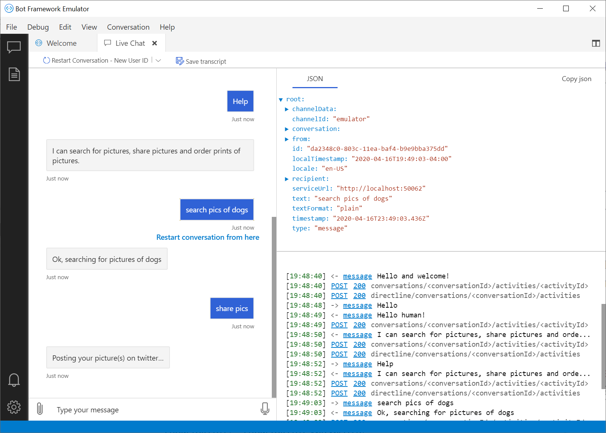
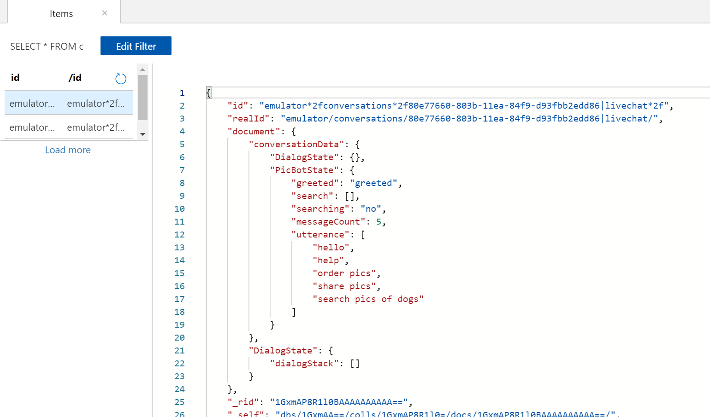

# Lab 4: Log Chats

## Introduction

This workshop demonstrates how you can perform logging using Microsoft Bot Framework and store aspects of chat conversations. After completing these labs, you should be able to:

- Understand how to intercept and log message activities between bots and users
- Log utterances to file storage

### Time to complete: 45 min

## Prerequisites

This lab starts from the assumption that you have built and published the bot from [Lab 3](../Lab03/README.md).

It is recommended that you do that lab in order to be able to implement logging as covered in this lab. If you have not, reading carefully through all the exercises and looking at some of the code or using it in your own applications may be sufficient, depending on your needs.

## Lab 4.0: Intercepting and analyzing messages

In this lab, we'll look at some different ways that the Bot Framework allows us to intercept and log data from conversations that the bot has with users. To start we will utilize the In Memory storage, this is good for testing purposes, but not ideal for production environments.

Afterwards, we'll look at a very simple implementation of how we can write data from conversations to files in Azure. Specifically, we'll put messages users send to the bot in a list, and store the list, along with a few other items, in a temporary file (though you could change this to a specific file path as needed)

### Using the Bot Framework Emulator

Let's take a look and what information we can glean, for testing purposes, without adding anything to our bot.

1. Open **Starter** folder in VS Code. [Starter](./code/Starter)

> **Note** You can use your previous solution if you did not do Lab 3.

1. Press **F5** to run your bot

1. Open the bot in the Bot Framework Emulator and have a quick conversation:

1. Review the bot emulator debug area, notice the following:

- If you click on a message, you are able to see its associated JSON with the "Inspector-JSON" tool on the right. Click on a message and inspect the JSON to see what information you can obtain.

- The "Log" in the bottom right-hand corner, contains a complete log of the conversation. Let's dive into that a little deeper.

  - The first thing you'll see is the port the Emulator is listening on

  - You'll also see where ngrok is listening, and you can inspect the traffic to ngrok using the "ngrok traffic inspector" link. However, you should notice that we will bypass ngrok if we're hitting local addresses. **ngrok is included here for your information, as remote testing is not covered in this workshop**

  - If there is an error in the call (anything other than POST 200 or POST 201 response), you'll be able to click it and see a very detailed log in the "Inspector-JSON". Depending on what the error is, you may even get a stack trace going through the code and attempting to point out where the error has occurred. This is greatly useful when you're debugging your bot projects.

  - You can also see that there is a `Luis Trace` when we make calls out to LUIS. If you click on the `trace` link, you're able to see the LUIS information. You may notice that this is not set up in this particular lab.



You can read more about testing, debugging, and logging with the emulator [here](https://docs.microsoft.com/en-us/azure/bot-service/bot-service-debug-emulator?view=azure-bot-service-4.0&tabs=javascript).

## Lab 4.1: Logging to Azure Storage

The default bot storage provider uses in-memory storage that gets disposed of when the bot is restarted. This is good for testing purposes only. If you want to persist data but do not want to hook your bot up to a database, you can use the Azure storage provider or build your own provider using the SDK.

1. Open the **index.js** file.  Since we want to use this process for every message, we'll use our startup class to add storing information to an Azure Blob file. Notice that currently we're using:

```js
const memoryStorage = new MemoryStorage();
```

As you can see, our current implementation is using in-memory storage. Again, this memory storage is recommended for local bot debugging only. When the bot is restarted, anything stored in memory will be gone.

1. Replace the current `MemoryStorage` line with the following to change it to a FileStorage based persistance:

```js
var blobStorage = new BlobStorage({
    containerName: process.env.BLOB_CONTAINER_NAME,
    storageAccountOrConnectionString: process.env.BLOB_STRING
});
```
you also need to add on top following reference: 

```js
const { BlobStorage } = require('botbuilder-azure');
```

and run command **npm install botbuilder-azure**  to obtain the package.

1. Switch to the Azure Portal, navigate to your blob storage account

1. From the **Overview** tab, click **Containers**

1. Check if a **chatlog** container exists, if it does not click **+Container**:

- For the name, type **chatlog**, click **OK**

1. If you haven't already done so, click **Access keys** and record your connection string

1. Open the **.env** and add your blob connection string details:

```ini
BLOB_CONTAINER_NAME=chatlog
BLOB_STRING=theConnectionString
```

1. Press **F5** to run the bot.

1. In the emulator, go through a sample conversation with the bot.

> **Note** If you do note get a reply back, check your Azure Storage Account connection string

1. Switch to the Azure Portal, navigate to your blob storage account

1. Click **Containers**, then open the **ChatLog** container

1. Select the chat log file, it should start with **emulator...**, then select **Edit blob**.  What do you see in the files? What don't you see that you were expecting/hoping to see?

You should see something similar to this:

```json
{
    "id": "emulator%2Fconversations%2Faf4ca0a0-8038-11ea-996a-95d981a865b2%7Clivechat",
    "realId": "emulator/conversations/af4ca0a0-8038-11ea-996a-95d981a865b2|livechat/",
    "document": {
        "conversationData": {
            "DialogState": {},
            "PicBotState": {
                "greeted": "greeted",
                "search": [],
                "searching": "no",
                "messageCount": 7,                
            }
        },
        "DialogState": {
            "dialogStack": []
        },
        "eTag": "*"
    }
}
```

## Lab 4.2: Logging utterances to a file

For the purposes of this lab, we are going to focus on the actual utterances that users are sending to the bot. This could be useful to determine what types of conversations and actions users are trying to complete with the bot.

We can do this by updating what we're storing in our `PictureState` object in the **pictureState.js** file and by adding information to the object in **pictureState.js**:

1. Open **pictureState.js**

1. **after** the following code:

```js
class PictureState {
    constructor() {
```

add:

```js
    this.utterance = [];
```

In the above, we're simple creating a list where we'll store the list of messages that users send to the bot.

In this example we're choosing to use the state manager to read and write data, but you could alternatively [read and write directly from storage without using state manager](https://docs.microsoft.com/en-us/azure/bot-service/bot-builder-howto-v4-storage?view=azure-bot-service-4.0&tabs=csharpechorproperty%2Ccsetagoverwrite%2Ccsetag).

> If you choose to write directly to storage, you could set up eTags depending on your scenario. By setting the eTag property to `*`, you could allow other instances of the bot to overwrite previously written data, meaning that the last writer wins. We won't get into it here, but you can [read more about managing concurrency](https://docs.microsoft.com/en-us/azure/bot-service/bot-builder-howto-v4-storage?view=azure-bot-service-4.0&tabs=csharpechorproperty%2Ccsetagoverwrite%2Ccsetag#manage-concurrency-using-etags).

The final thing we have to do before we run the bot is add messages to our list with our `onMessage` action.

1. In **bot.js**, **before** the following code:

```js
await next();
```

add:

```js
conversationState.PicBotState.utterance.push(context.activity.text);
await this.conversationState.saveChanges(context, false);
```

> **Note** We have to save the state if we modify it

The first line takes the incoming message from a user and stores it in a variable called `utterance`. The next line adds the utterance to the existing list that we created in PictureState.cs.

1. Press **F5** to run the bot.

1. Have another conversation with the bot. Stop the bot and check the latest blob persisted log file. What do we have now?

```json
{
    "id": "emulator%2Fconversations%2Faf4ca0a0-8038-11ea-996a-95d981a865b2%7Clivechat",
    "realId": "emulator/conversations/af4ca0a0-8038-11ea-996a-95d981a865b2|livechat/",
    "document": {
        "conversationData": {
            "DialogState": {},
            "PicBotState": {
                "greeted": "greeted",
                "search": [],
                "searching": "no",
                "messageCount": 4,
                "utterance": [
                    "hello",
                    "help",
                    "share pics",
                    "order pics"
                ]
            }
        },
        "DialogState": {
            "dialogStack": []
        },
        "eTag": "*"
    }
}
```

>Get stuck or broken? You can find the solution for the lab up until this point under [/code/Ex02](./code/Ex02). You will need to insert the keys for your Azure Bot Service and your Azure Storage settings in the `.env` file. We recommend using this code as a reference, not as a solution to run, but if you choose to run it, be sure to add the necessary keys.

## Lab 4.3 Logging to Cosmos DB

To incorporate database storage and testing into your logging solution, we recommend the following steps to integrate your solution with Cosmos DB

1. Open the **index.js** file.  Since we want to use this process for every message, we'll use our startup class to add storing information to an Cosmos DB. Notice that currently we're using Azure Storage account:

```js
var blobStorage = new BlobStorage({.....})
```

As you can see, our current implementation is Azure Storage.Previously we used in memory storage recommended for local bot debugging only. When the bot is restarted, anything stored in memory will be gone.

1. Replace the current `blobStorage` line with the following to change it to a Cosmos DB store:

```js
var blobStorage = new CosmosDbPartitionedStorage({
    cosmosDbEndpoint: process.env.DB_SERVICE_ENDPOINT,
    authKey: process.env.AUTH_KEY,
    databaseId: process.env.DATABASE_ID,
    containerId: process.env.CONTAINER
});
```

you also need to replace `BlobStorag`e to `CosmosDbPartitionedStorage` on the top of the file. The packages `botbuilder-azure` should be already installed.

```js
const { CosmosDbPartitionedStorage } = require('botbuilder-azure');
```

1. Now you need to update **.env** and add your own Cosmos DB credentials:

```ini
DB_SERVICE_ENDPOINT=http://....
AUTH_KEY=ABCD
DATABASE_ID=BotData
CONTAINER=BotJS
```

1. Now you can manually create a new collection in the Cosmos DB like you did in the LAB02[../Lab02/README.md]

1. Use following parameters: 
  - **Database id** should be `BotData`;
  - **Container id** should be `BotJS`;
  - **Partition key** should be `/id`;
  - keep rest by default.

1. Press **F5** to run the bot.

1. Have another conversation with the bot. Stop the bot and check the latest Cosmos DB file. It should looks like as following:



>Get stuck or broken? You can find the solution for the lab up until this point under [/code/Finished](./code/Finished). You will need to insert the keys for your Azure Bot Service and your Azure Storage settings in the `.env` file. We recommend using this code as a reference, not as a solution to run, but if you choose to run it, be sure to add the necessary keys.

## Next Steps

- [Lab 05-01: QnA Maker](../Lab5/README.md)
