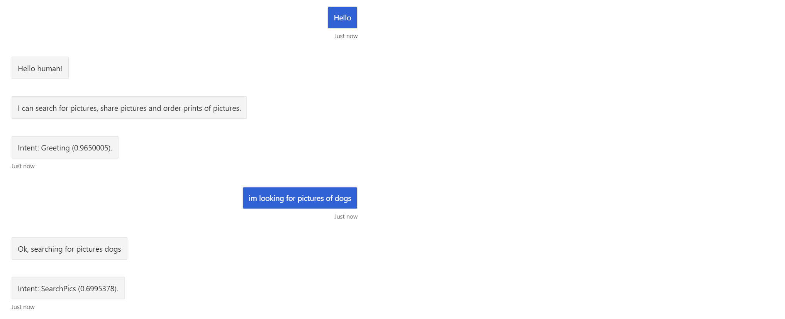

# Lab 7: Integrate LUIS into Bot Dialogs

## Introduction

Our bot is now capable of taking in a user's input and responding based on the user's input. Unfortunately, our bot's communication skills are brittle. One typo, or a rephrasing of words, and the bot will not understand. This can cause frustration for the user. We can greatly increase the bot's conversational abilities by enabling it to understand natural language with the LUIS model we built in [Lab 6](../Lab06/README.md)"

We will have to update our bot in order to use LUIS.  We can do this by modifying "index.js" and "bot.js"

> Prerequisites: This lab builds on [Lab 3](../Lab03/README.md). It is recommended that you do that lab in order to be able to implement logging as covered in this lab. If you have not, reading carefully through all the exercises and looking at some of the code or using it in your own applications may be sufficient, depending on your needs.

> NOTE: If you intend to use the code in the Finished folder, you MUST replace the app specific information with your own app IDs and endpoints.

## Lab 7.1: Adding natural language understanding

### Adding LUIS to index.js

1. If not already open, open your folder with solution in Visual Studio Code

> **NOTE** You can also start with the **{GitHubPath}/Lab07/code/Starter/** solution if you did not start from Lab 1.
> Be sure to replace all the app settings values in **.evn** file

1. Open **index.js** and locate the `PicBotDialogSet` class initialization. We'll add LUIS here by adding an additional service for LUIS after creating and registering the state accessors.

Find line:

```js
const dialogSet = new PicBotDialogSet(conversationState);
```

Replace with:

```js
const luisConfig = {
    applicationId: process.env.LuisAppId,
    endpointKey: process.env.LuisAPIKey,
    endpoint: process.env.LuisAPIHostName
};
const luisRecognizer = new PicBotLuisRecognizer(luisConfig);

// Create the main dialog.
const dialogSet = new PicBotDialogSet(conversationState, luisRecognizer);
```

1. Modify the **.env** to include the following properties, be sure to fill them in with your LUIS instance values. Refer to the previous labs to find out where the values located:

```ini
LuisAppId=""
LuisAPIKey=""
LuisAPIHostName=""
```

> **Note** The Luis endpoint url for the .NET SDK should be something like **https://{region}.api.cognitive.microsoft.com** with no api or version after it.


1. Add link to the top of the `index.js` to the new file you will build in the next exercise.

```js
const { PicBotLuisRecognizer } = require('./picBotLuisRecognizer');
```

## Lab 7.2: Adding LUIS to PictureBot's MainDialog

1. Open **PicBotDialogSet.js**. The first thing you'll need to do is add the LUIS recognizer. Update constructor below by adding luisRecognizer:

```js
 constructor(conversationState, luisRecognizer) 
```

and add the following in the bottom of the constructor:

```js
this.luisRecognizer = luisRecognizer;
```

1. Now we need to implement luisRecognizer class. Add a new file to the project with name **picBotLuisRecognizer.js** and provide following code in the head of the file.

```js
const { LuisRecognizer } = require('botbuilder-ai');
```
1. To add the following package to your modules please run the command in the terminal:

**npm install botbuilder-ai**

1. Now you can add constructor to in the LUIS recognizer:

```js
class PicBotLuisRecognizer {
    constructor(config) {
        const luisIsConfigured = config && config.applicationId && config.endpointKey && config.endpoint;
        if (luisIsConfigured) {
            this.recognizer = new LuisRecognizer(config, {}, true);
        }
    }
    //add you code here
}
exports.PicBotLuisRecognizer = PicBotLuisRecognizer;
```
1. Lets also add following code to the LuisRecognizer class. Add the following method to check status: 

```js
get isConfigured() {
        return (this.recognizer !== undefined);
}
```

1. Add the following code to class 

```js
async executeLuisQuery(context) {
        return await this.recognizer.recognize(context);
}

getEntities(result) {
        let entities = '';
        if (result.entities !== undefined && result.entities.facet !== undefined && result.entities.facet.length > 0) {
            entities = result.entities.facet.join(', ');
        }
        return entities;
}
```

1. Add the main method ot find the top intent.

```js
getTopIntent(result) {
        var intent = 'None';
        var score = 0;
        if (result.luisResult !== undefined && result.luisResult.topScoringIntent !== undefined) {
            intent = result.luisResult.topScoringIntent.intent;
            score = result.luisResult.topScoringIntent.score;
        }

        return {
            intent: intent,
            score: score
        };
}
```

1. Now lets update our `PicBotDialogSet`. In the `mainMenu` command lets update the par responsible for processing Regex. If Regex doesn't find an intent, we want the update when `recognizedIntents` not able to detect the main intent. Action should to be different. That's when we want to call LUIS.

Within the `mainMenu` switch block, replace:

```js
} else {
    await ReplyWithConfused(stepContext.context);
    return stepContext.endDialog();
}
```

With:

```js
} else {
    await this.askLuis(stepContext);
    return stepContext.endDialog();
}
```

1. You als need to add `askLuis` function to the same class.

```js
  async askLuis(stepContext) {
        if (!this.luisRecognizer.isConfigured) {
            const messageText = 'NOTE: LUIS is not configured. To enable all capabilities, add `LuisAppId`, `LuisAPIKey` and `LuisAPIHostName` to the .env file.';
            stepContext.sendActivity(messageText);
            return await stepContext.next();
        }

        var luisResult = await this.luisRecognizer.executeLuisQuery(stepContext.context);
        var topIntent = this.luisRecognizer.getTopIntent(luisResult);
        switch (topIntent.intent) {
        case 'None': {
            await ReplyWithConfused(stepContext.context);
            await ReplyWithLuisScore(stepContext.context, topIntent.intent, topIntent.score);
            break;
        }
        case 'Greeting': {
            await ReplyWithGreeting(stepContext.context);
            await ReplyWithHelp(stepContext.context);
            await ReplyWithLuisScore(stepContext.context, topIntent.intent, topIntent.score);
            break;
        }
        case 'OrderPic': {
            await ReplyWithOrderConfirmation(stepContext.context);
            await ReplyWithLuisScore(stepContext.context, topIntent.intent, topIntent.score);
            break;
        }
        case 'SharePic': {
            await ReplyWithShareConfirmation(stepContext.context);
            await ReplyWithLuisScore(stepContext.context, topIntent.intent, topIntent.score);
            break;
        }
        case 'SearchPics': {
            var ents = this.luisRecognizer.getEntities(luisResult);
            await ReplyWithSearchConfirmation(stepContext.context, ents);
            await ReplyWithLuisScore(stepContext.context, topIntent.intent, topIntent.score);
            break;
        }
        default: {
            await ReplyWithConfused(stepContext.context);
        }
        }
    }
```

1. Let's briefly go through what we're doing in the new code additions. First, instead of responding saying we don't understand, we're going to call LUIS. So we call LUIS using the LUIS Recognizer, and we store the Top Intent in a variable. We then use `switch` to respond in different ways, depending on which intent is picked up. This is almost identical to what we did with Regex.

> **Note** If you named your intents differently in LUIS than instructed in the code accompanying [Lab 6](../Lab06/README.md), you need to modify the `case` statements accordingly!

Another thing to note is that after every response that called LUIS, we're adding the LUIS intent value and score. The reason is just to show you when LUIS is being called as opposed to Regex (you would remove these responses from the final product, but it's a good indicator for us as we test the bot).

## Lab 7.3: Testing natural speech phrases

1. Run the app.

1. Switch to your Bot Emulator. Try sending the bots different ways of searching pictures. What happens when you say "send me pictures of water" or "show me dog pics"? Try some other ways of asking for, sharing and ordering pictures.



If you have extra time, see if there are things LUIS isn't picking up on that you expected it to. Maybe now is a good time to go to luis.ai, [review your endpoint utterances](https://docs.microsoft.com/en-us/azure/cognitive-services/LUIS/label-suggested-utterances), and retrain/republish your model.

> **Fun Aside**: Reviewing the endpoint utterances can be extremely powerful.  LUIS makes smart decisions about which utterances to surface.  It chooses the ones that will help it improve the most to have manually labeled by a human-in-the-loop.  For example, if the LUIS model predicted that a given utterance mapped to Intent1 with 47% confidence and predicted that it mapped to Intent2 with 48% confidence, that is a strong candidate to surface to a human to manually map, since the model is very close between two intents.

## Going further

If you're having trouble customizing your LUIS implementation, review the documentation guidance for adding LUIS to bots [here](https://docs.microsoft.com/en-us/azure/bot-service/bot-builder-howto-v4-luis?view=azure-bot-service-4.0&tabs=cs).

>Get stuck or broken? You can find the solution for the lab up until this point under [code/Finished](./code/Finished). You will need to insert the keys for your Azure Bot Service in the `.env` file. We recommend using this code as a reference, not as a solution to run, but if you choose to run it, be sure to add the necessary keys (in this section, there shouldn't be any).

## **Extra Credit**

If you wish to attempt to integrate LUIS bot including Azure Cognitive Search, building on the prior supplementary LUIS model-with-search [training] (https://github.com/Azure/LearnAI-Bootcamp/tree/master/lab01.5-luis), follow the following trainings: [Azure Cognitive Search](https://github.com/Azure/LearnAI-Bootcamp/tree/master/lab02.1-azure_search), and [Azure Cognitive Search Bots](https://github.com/Azure/LearnAI-Bootcamp/blob/master/lab02.2-building_bots/2_Azure_Search.md).

## Next Steps

- [Lab 08-01: Detect Language](../Lab8/README.md)
