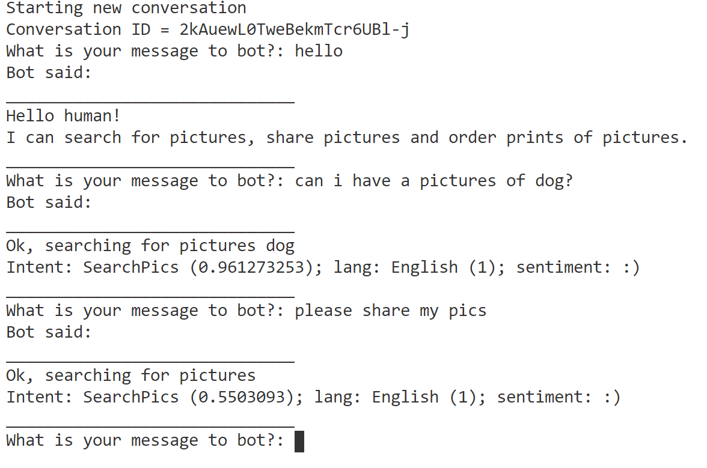
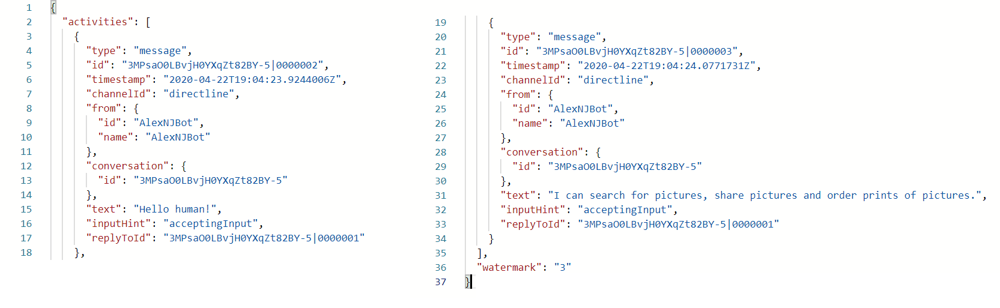
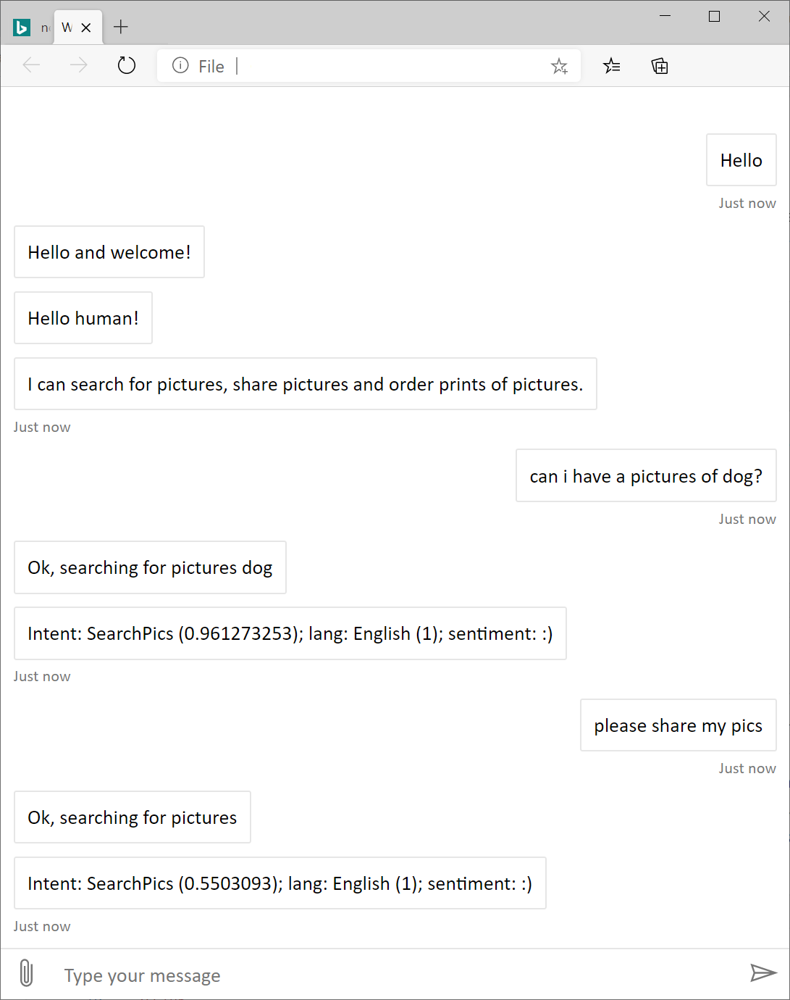

# Lab 9: Test Bots in DirectLine

## Introduction

Communication directly with your bot may be required in some situations. For example, you may want to perform functional tests with a hosted bot. Communication between your bot and your own client application can be performed using the [Direct Line API](https://docs.microsoft.com/en-us/bot-framework/rest-api/bot-framework-rest-direct-line-3-0-concepts).

Additionally, sometimes you may want to use other channels or customize your bot further. In that case, you can use Direct Line to communicate with your custom bots.

Microsoft Bot Framework Direct Line bots are bots that can function with a custom client of your own design. Direct Line bots are similar to normal bots. They just don't need to use the provided channels. Direct Line clients can be written to be whatever you want them to be. You can write an Android client, an iOS client, or even a console-based client application.

This hands-on lab introduces key concepts related to Direct Line API.

## Lab 9.0: Prerequisites

This lab starts from the assumption that you have built and published the bot from [Lab 3](../Lab03/README.md). It is recommended that you do that lab in order to be successful in the ones that follow. If you have not, reading carefully through all the exercises and looking at some of the code or using it in your own applications may be sufficient, depending on your needs.

We'll also assume that you've completed [Lab 4](../Lab04/README.md), but you should be able to complete the labs without completing the logging labs.

You can also continue with your previous hands-on result or find completed solution in the **{GitHubPath}/Lab09/code/Bot/** folder.

### Update settings

1. Make sure your project contains **.env** file and it has following keys.  

>_Keys_
>
>- MicrosoftAppId=
>- MicrosoftAppPassword=
>- ScmType=None
>- DB_SERVICE_ENDPOINT=
>- AUTH_KEY=
>- DATABASE_ID=
>- CONTAINER=
>- LuisAppId=
>- LuisAPIKey=
>- LuisAPIHostName=
>- TextAnalyticsKey=
>- TextAnalyticsHostName=

1. You can refer to the labs #3-8 to find details where and how collects required keys.

## Lab 9.1: Publish Your Bot

1. Open your bot solution in Visual Studio Code

1. Run the bot in debug and make sure it properly works.

1. To publish bot from VS code you need to install following extensions: 

[Azure Tools](https://marketplace.visualstudio.com/items?itemName=ms-vscode.vscode-node-azure-pack)
[Azure Web App](https://marketplace.visualstudio.com/items?itemName=ms-azuretools.vscode-azureappservice)

1. From VS menu select "View>Command Pallet" and type "Deploy to Web App"

1. Select the subscription you have been using

1. Select Web App with name equal the Bot you have build on [Lab03](../Lab03/README.md)

1. Wait while publishing will be competed. You can monitor progress in the console window.
 

## Lab 9.2: Setting up the Direct Line channel

1. In the portal, locate your published PictureBot **web app bot** and navigate to the **Channels** tab.

1. Select the Direct Line icon (looks like a globe). You should see a **Default Site** displayed.

1. For the **Secret keys**, select **Show** and store one of the secret keys in Notepad, or wherever you are keeping track of your keys.

You can read detailed instructions on [enabling the Direct Line channel](https://docs.microsoft.com/en-us/azure/bot-service/bot-service-channel-connect-directline?view=azure-bot-service-4.0) and [secrets and tokens](https://docs.microsoft.com/en-us/azure/bot-service/rest-api/bot-framework-rest-direct-line-3-0-authentication?view=azure-bot-service-3.0#secrets-and-tokens).

## Lab 9.3: Create a console application

We'll create a console application to help us understand how Direct Line can allow us to connect directly to a bot. The console client application we will create operates in two threads. The primary thread accepts user input and sends messages to the bot. The secondary thread polls the bot once per second to retrieve any messages from the bot, then displays the messages received.

> **Note** The instructions and code here have been modified from the [Key concepts in Direct Line API 3.0](https://docs.microsoft.com/en-us/azure/bot-service/rest-api/bot-framework-rest-direct-line-3-0-concepts?view=azure-bot-service-4.0).

1. If not already open, open folder **Starter** in Visual Studio Code.

1. Then then locate file **index.js** and observe existed content.

1. From the new terminal type **npm install** to restore npm packages

1. Create **.env** file and provide following content. The Key is Direct Line key you copy on previous step:

```ini
DirectLineKey=
```

1. Return to  **index.js** and add to the top of the file reference to the file `directLine.js` as following:

```js
const { DirectLine } = require('./directLine');
```

1. Observe implementation of DirectLine class. Pay attention on the functions `getToken`, `getConversationId`, `sendMessage` and `getMessage`. The functions need to be call in following sequence: 

>- getToken - to obtain token if required. 
>- getConversationId - to obtain conversation ID to start new conversation
>- sendMessage - send message to the bot and get watermark
>- getMessage - receive message to the bot by watermark

1. Provide the following line in after the line **dotenv.config({ path: ENV_FILE });** to build the helper class and configure with Direct line key.

```js
const line = new DirectLine(process.env.DirectLineKey);
```

1. Now you can create a functions to aks a question to send it to the bot. 

```js
function askQuestion(query) {
    const rl = readline.createInterface({
        input: process.stdin,
        output: process.stdout
    });

    return new Promise(resolve => rl.question(query, ans => {
        rl.close();
        resolve(ans);
    }));
}
```
1. We will use `readline` npm package and you need run following command to install the package.

```cmd
npm install readline
```

1. You also need to add following line in the top of the `index.js` file.

```js
const readline = require('readline');
```
1. Next step is implement `main` function. Add following code at the bottom of the file.

```js
async function main() {
    this.msg = '';

    await line.Init();
    console.log('Starting new conversation');
    console.log(`Conversation ID = ${ line.conversationId }`);

    while (this.yourmsg !== 'exit') {
        this.yourmsg = await askQuestion('What is your message to bot?: ');
        await line.sentMessage(this.yourmsg)
            .then((watermark) => line.getMessage(watermark))
            .then(msg => printActivity(msg));
    }
}

main();
```

1. The last step is print the response from the bot. For this task we will use the function `printActivity` provided next:

```js
async function printActivity(msg) {
    console.log('Bot said:');
    console.log('______________________________');
    await msg.activities.forEach(activity => {
        console.log(activity.text);
    });
    console.log('______________________________');
}
```

Spend some time reviewing this sample code. It's a good exercise to make sure you understand how we're connecting to our PictureBot and getting responses.

### Run the app

1. Next from terminal type command `ndoe index.js` or run in debug mode.

1. Have a conversation with the bot using the commandline application



> **Note**  If you do not get a response, it is likely you have an error in your bot.  Test your bot locally using the Bot Emulator, fix any issues, then republish it.

Quick quiz - how are we displaying the Conversation ID? We'll see in the next sections why we might want this.

>Get stuck or broken? You can find the solution for the lab up until this point under [code/Finished](./code/Finished). You will need to insert the keys for your Azure Bot Service in the `.env` file. We recommend using this code as a reference, not as a solution to run, but if you choose to run it, be sure to add the necessary keys (in this section, there shouldn't be any).


## Lab 9.4: Using HTTP Get to retrieve messages

Because we have the conversation ID, we can retrieve user and bot messages using HTTP Get. If you are familiar and experienced with Rest Clients, feel free to use your tool of choice.

In this lab, we will go through using Postman (a web-based client) to retrieve messages.

### Download Postman

1. [Download the native app for your platform](https://www.getpostman.com/apps). You may need to create a simple account.

### Test the App

Using Direct Line API, a client can send messages to your bot by issuing HTTP Post requests. A client can receive messages from your bot either via WebSocket stream or by issuing HTTP GET requests. In this lab, we will explore HTTP Get option to receive messages.

We'll be making a GET request. We also need to make sure the header contains our header name (**Authorization**) and header value (**Bearer YourDirectLineSecret**). Addtionally, we'll make the call to our existing conversation in the console app, by replaceing {conversationId} with our current Conversation ID in our request: `https://directline.botframework.com/api/conversations/{conversationId}/messages`.

Postman makes this very easy for us to configure:

- Change the request to type "GET" using the drop down.
- Enter your request URL with your Conversation ID.
- Change the Authorization to type "Bearer Token" and enter your Direct Line Secret key in the "Token" box.


1. Open **Postman**

1. For the type, ensure that **GET** is selected

1. For the url, type **https://directline.botframework.com/api/conversations/{conversationId}/messages**.  Be sure to replace the conversationId with your specific conversation id

1. Select **Authorization**, for the type, select **Bearer Token**

1. Set the value to **{Your Direct Line Secret}**

1. Finally, select **Send**.

1. Inspect your results.

1. Create a new conversation with your console app and be sure to search for pictures.

1. Create a new request using Postman using the new conversation id.

1. Inspect the response returned.  You should find the image url displayed within the images array of the response




## Lab 9.5: Using Web page client to communicate with bot.

In the next task you will be build a Web control for website page. The control will help you to communicate with your bot by use Direct Line and let users to get help while they surfing across you web site. 

1. Create new `test.html` page with following content:

```html
<!DOCTYPE html>
<html lang="en-US">
  <head>
    <title>Web Chat with Streaming Extensions</title>
    <style type="text/css">
      html, body, body > div { height: 100%; }
      body { margin: 0; }
    </style>
  </head>
  <body>
    Hello world!
  </body>
</html>
```

1. Lest open this page in browser on your chose. Make sure that page is executed and preview a single line of "Hello world"

1. Next we need to add reference to the `BotFramework-DirectLineJS` package. Provide following lines in between `<head></head>` tags

```html
    <script src="https://cdn.botframework.com/botframework-webchat/latest/webchat-es5.js"></script>
    <script src="https://github.com/microsoft/BotFramework-DirectLineJS/releases/download/dev-streamingextensions/directline.js"></script>
```

1. Next provide JavaScript in between `<body></body>` tags. 

```html
  <script>
      const { DirectLine } = window.DirectLine;
      const webChatElement = document.createElement('div');

      window.WebChat.renderWebChat({
        directLine: new DirectLine({
          secret: '',
          domain: 'https://directline.botframework.com/v3/directline',
          webSocket: true
        })
      }, webChatElement);

      document.body.append(webChatElement);
    </script>
```

>**NOTE** provide the Direct line key in the `secret` line

1. Now lets test this page in browser again. After refresh you should see the field to type message to the bot. Please start with greeting. Then go with the test you did before from console application. 



>Get stuck or broken? You can find the solution for the lab up until this point under [code/Finished](./code/Finished). You will need to insert the keys for your Azure Bot Service in the `.env` file. We recommend using this code as a reference, not as a solution to run, but if you choose to run it, be sure to add the necessary keys (in this section, there shouldn't be any).

## Going further

Have extra time? Can you leverage curl (download link: https://curl.haxx.se/download.html) from the terminal to retrieve conversations (like you did for Postman)?

> Hint: your command may look similar to `curl -H "Authorization:Bearer {SecretKey}" https://directline.botframework.com/api/conversations/{conversationId}/messages -XGET`

## Resources

- [Direct Line API](https://docs.microsoft.com/en-us/bot-framework/rest-api/bot-framework-rest-direct-line-3-0-concepts)
- [BotFramework-DirectLineJS](https://github.com/Microsoft/BotFramework-DirectLineJS)
